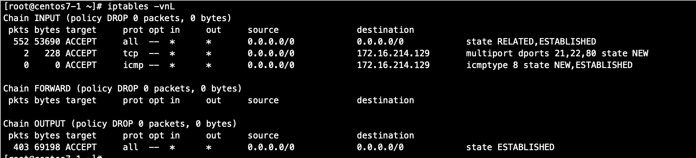

#### 开放 ssh 协议

```
~]# iptables -I INPUT -d 172.16.214.129  -p tcp --dport 22 -j ACCEPT
~]# iptables -I OUTPUT -s 172.16.214.129  -p tcp --sport 22 -j ACCEPT
```

#### ICMP

```
// 允许自己 ping别人
~]# iptables -A OUTPUT -s 172.16.214.129 -p icmp --icmp-type 8 -j ACCEPT
~]# iptables -A INPUT -d 172.16.214.129 -p icmp --icmp-type 0 -j ACCEPT
```
```
// 允许别人 ping 自己
~]# iptables -A INPUT -d 172.16.214.129 -p icmp --icmp-type 8 -j ACCEPT
~]# iptables -A OUTPUT -s 172.16.214.129 -p icmp --icmp-type 0 -j ACCEPT
```

#### 显式扩展

1、multiport扩展：以离散方式定义多端口匹配；最多指定15个端口

```
~]# iptables -I INPUT -d 172.16.0.0/16 -p tcp -m multiport --dport 22,80 -j ACCEPT
~]# iptables -I OUTPUT -s 172.16.0.0/16 -p tcp -m multiport --sport 22,80 -j ACCEPT
```

2、iprange扩展：指明连续的（但一般是不能扩展为整个网络）ip地址范围时使用

```
~]# iptables -I INPUT -d 172.16.214.129 -p tcp -m multiport --dport 22,23,80 -m  iprange --src-range 172.16.214.1-172.16.214.120 -j ACCEPT
~]# iptables -I OUTPUT -s 172.16.214.129 -p tcp -m multiport --sport 22,23,80 -m  iprange --dst-range 172.16.214.1-172.16.214.120 -j ACCEPT
```

3、string扩展：检查报文中出现的字符串

```
~ curl 172.16.214.129/bad.html
this is a movie page
~]# iptables -I OUTPUT -m string --algo bm --string "movie" -j REJECT
```

4、time扩展：根据报文到达的时间与指定的时间范围进行匹配

```
~]# iptables -I INPUT -d 172.16.214.129 -p tcp --dport 80 -m time --timestart 00:00 --timestop 23:39 -j REJECT
```

5、connlimit扩展：根据每客户端IP（也可以是地址块）做并发连接数数量匹配
```
// 限制ssh的最大连接数为3
~]# iptables -I INPUT -p tcp --dport 22 -m connlimit --connlimit-above 3 -j REJECT
```

6、limit扩展：基于收发报文的速率做检查

```
// 限制 icmp 的 ping 速率
~]#  iptables -I INPUT -d 172.16.214.129 -p icmp --icmp-type 8 -m limit --limit-burst 5 --limit 10/minute -j ACCEPT
```

7、state扩展：根据连接追踪机制检查连接的状态

```
~]# iptables -I INPUT  -d 172.16.214.129 -p icmp --icmp-type=8 -m state --state NEW,ESTABL
ISHED -j ACCEPT
~]# iptables -I INPUT -m state --state ESTABLISHED -j ACCEPT
~]# iptables -I INPUT 2 -d 172.16.214.129 -p tcp -m multiport --dport 22,80 -m state --state NEW -j ACCEPT
~]# iptables -I OUTPUT -m state --state ESTABLISHED -j ACCEPT  // 只要能进来就一定能放行
```

- 调整连接追踪功能所能够容纳的最大连接数量：`/proc/sys/net/nf_conntrack_max`

- 已经追踪到并记录下的连接：`/proc/net/nf_conntrack`

- 不同协议或连接类型追的时长：`/proc/sys/net/netfilter/`

- 可追踪的连接状态：
  - NEW：新发出的请求；连接追踪模板中不存此连接相关的信息条目，因此，将其识别为第一次发出的请求
  - ESTABLISHED：NEW状态之后，连接追踪模板中为其建立的条目失效之前期间内所进行的通信的状态
  - RELATED：相关的连接；如ftp协议的命令连接与数据连接之间的关系
  - INVALIED：无法识别的连接

#### 开放被动模式的 FTP 服务

1. 装载ftp追踪时的专用的模块

```
~]# modprobe nf_conntrack_ftp
```

2. 放行请求报文

- 命令连接：NEW, ESTABLISHED
- 数据连接：RELATED, ESTABLISHED

```
# iptables -A INPUT -d 172.16.214.129 -p tcp --dport 21 -m state --state NEW,ESTABLISHED -j ACCEPT
# iptables -A INPUT -d LocalIP -p tcp -m state --state RELATED,ESTABLISHED -j ACCEPT
```

3. 放行响应报文：

- ESTABLISEHD

```
# iptables -A OUTPUT -s LocalIP -p tcp -m state --state ESTABLISHED -j ACCEPT
```


